# Analysis of coffee shops distributions in major Scandinavian cities
### Report - Applied Data Science Capstone - Coursera

## 1. Introduction
### 1.1. The third wave coffee movement
The third wave coffee movement considers coffee an artisanal food, like wine. It disrupts the more commodity-focused trade of coffee prioritizing taste quality, unique flavors, and equitable relationships over low prices and standardizations.

Pulitzer Prize winning food critic Jonathan Gold of LA Weekly defined the third wave of coffee by saying:

> The first wave of American coffee culture was probably the 19th-century surge that put Folgers on every table, and the second was the proliferation, starting in the 1960s at Peet's and moving smartly through the Starbucks grande decaf latte, of espresso drinks and regionally labeled coffee. We are now in the third wave of coffee connoisseurship, where beans are sourced from farms instead of countries, roasting is about bringing out rather than incinerating the unique characteristics of each bean, and the flavor is clean and hard and pure.

### 1.2. Business Problem

Third wave coffee is often associated with the concept of 'specialty coffee,' referring either to specialty grades of green coffee beans, or specialty coffee beverages to distinguish of the second-wave coffee characterized by coffee-shops franchises.

This coffee-shops are usually smaller than their franchise counterparts and have to play smartly to gain market-share. However, smaller players are increasingly finding opportunities in the specialty market, leading to a rise in per-capita coffee consumption. [Read more from here](https://www.mordorintelligence.com/industry-reports/europe-coffee-market)

From Wikipedia:
>Europe is already a major coffee market accounting for 30% of global consumption, but is seeing a growth in demand for specialty coffee while overall demand remains stable. In 2016, specialty coffee was Europe’s fastest growing major restaurant category, with an increase of 9.1% from 2014-2015.

As we can see from the Centre for the Promotion of Imports from developing countries (CBI) report specialty coffee is a growing niche market making it an interesting business opportunity.

From CBI:
> Europe is a large market for coffee. Opportunities for small and medium-sized suppliers from producing countries are best found in the growing specialty coffee market in Europe. Although still a niche market, there is a growing demand for high-quality and single origin coffees.
[Read more here](https://www.cbi.eu/market-information/coffee/trade-statistics/#the-european-market-for-specialty-coffee-is-growing)

### 1.3. Objective 
We can use the example of already successful specialty coffee shops from different cities of Europe to help us understand how they place themselves in the cafe scene. We will be focusing primarily in the geographic location and their distribution in the cities of: Stockholm, Gothenburg, Malmö, Oslo and Copenhagen.

The hypothesis is that: there exist distribution differences between traditional, chains and specialty cafes. Understanding this distribution can help us identify potential places where a new specialty coffee-shop will flourish.


## 2. Data
There is not a single place from where we can get all the information we need for this problem. Instead, we need to mix different sources of information and merge them into a dataset.

### 2.1. Specialty cafes

The on-line magazine [European Coffee Trip](https://europeancoffeetrip.com/) has collected the information of 1876 specialty coffeehouses across Europe. This information is organize in city guides. For example in this link you can find the city guide of Stockholm: https://europeancoffeetrip.com/stockholm/ 

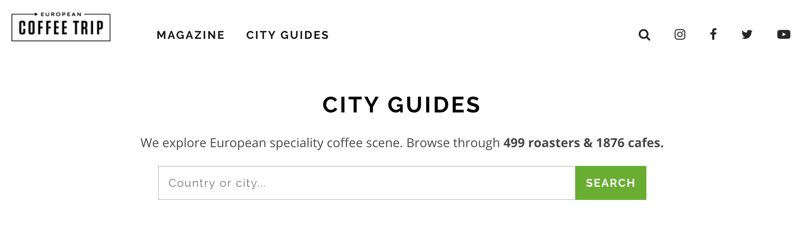

We can scrap this city guides and organize the data in a JSON file. We can later use that information to get the cafes latitude and longitude location. 

```json
{
  "Winchester": [
        "Thrive Cafe & Wellbeing",
        "The Winchester Orangery",
        "The Dispensary Kitchen",
        "Rawberry",
        "Hoxton Bakehouse Co.",
        "Coffee Lab"
    ],
    "Liverpool": [
        "Thoughtfully Kiosk",
        "Thoughtfully Cafe",
        "Ropes & Twines",
        "Mother Espresso",
        "Lovelocks"
    ],
    "Glasgow": [
        "Thomson's Central Caf\u00e9 Bar",
        "The Steamie",
        "The Cran",
        "sprigg",
        "Spitfire Espresso",
        "PROJECT by Dear Green",
        "Papercup Coffee Company",
        "Laboratorio Espresso",
        "Kaf",
        "It All Started Here",
        "The Black Pine Coffee Co."
    ]
}
  ```


### 2.2. Coffeehouses chains

We can get a list of coffeehouses chains from this sites: 
* https://en.wikipedia.org/wiki/List_of_coffeehouse_chains
* http://www.europeancoffeesymposium.com/nordic-coffee-culture-up-and-up/

This list is not so extensive and a simple python list containing the names of the most common coffeehouses can help us filter and tag appropriately the different places.

### 2.3. Geographic location

With a list of names for specialty and chains cafes we can use the Foursquare API to check for their geographical location. We can also use Foursquare "Explore" API to find all the other cafes in the area. We are going to focus only on the cities of Stockholm, Gothenburg, Malmö, Oslo and Copenhagen. The cafes will be divided into 3 categories: Specialty, Chain and Other. For that we are going to use a Python enum like this one: 

```python
class Cafe(Enum):
    SPECIALTY = 1
    CHAIN = 2
    OTHER = 3
```

We are using the "Search" API to find the location of the specialty cafes we scrapped from "European Coffee Trip" website. The results will be tagged using the enum Cafe.SPECIALTY. With this same API we make a general search to get all the coffeehouse chains in the area and tag those results with Cafe.CHAINS. Finally, we use their "Explore" API to find all the other cafes in the area and tag them as Cafe.OTHER.

This is how the information can be gathered in a dataset containing the cafes names, location, city, country and type.

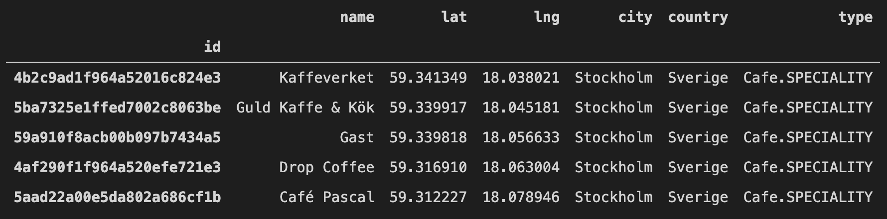

## 3. Methodology

Once our dataset is ready we can use it to apply different clustering techniques on their latitude and longitude coordinates. The analysis of the clustering results can shed light on how the cafes are positioned respectively to the coffeehouses chains. This information can help us find potential places for a new specialty coffee-shop.

### 3.1. Visualizing in the map

We will start by using `folium` to visualize with markers of different colors how this three classes of cafes distributes on each city.
> Markers color
> * Blue: Specialty cafes
> * Green: Coffeehouses chains
> * Red: Traditional cafes

#### Stockholm
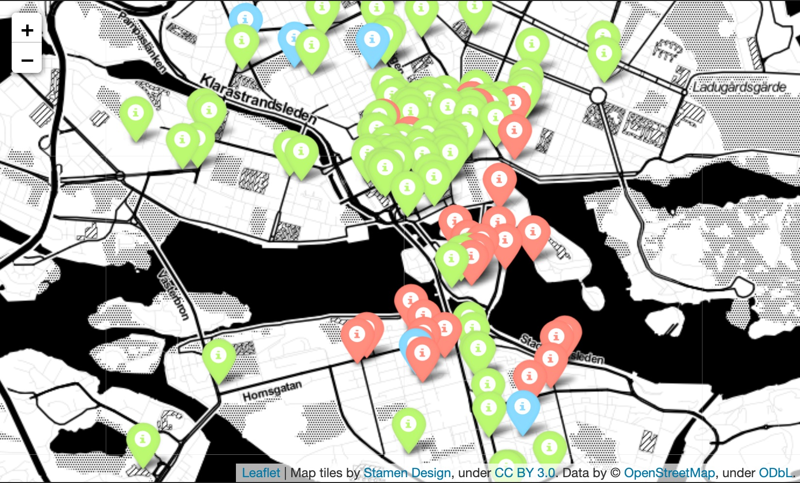

#### Gothenburg
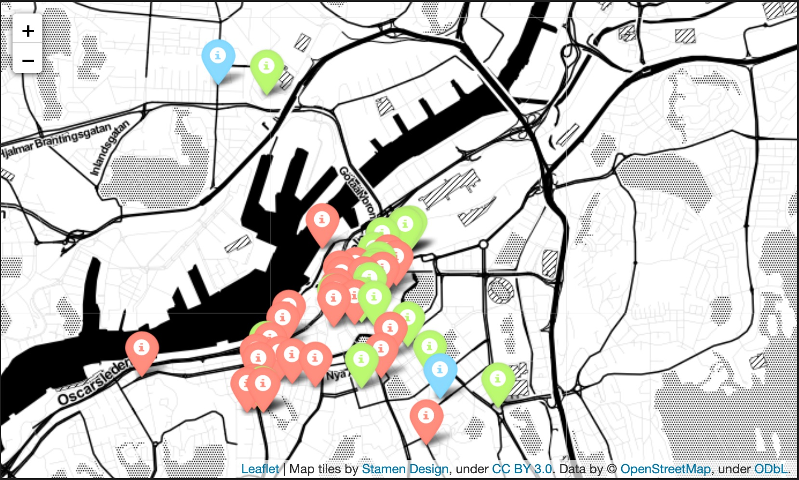

#### Malmö
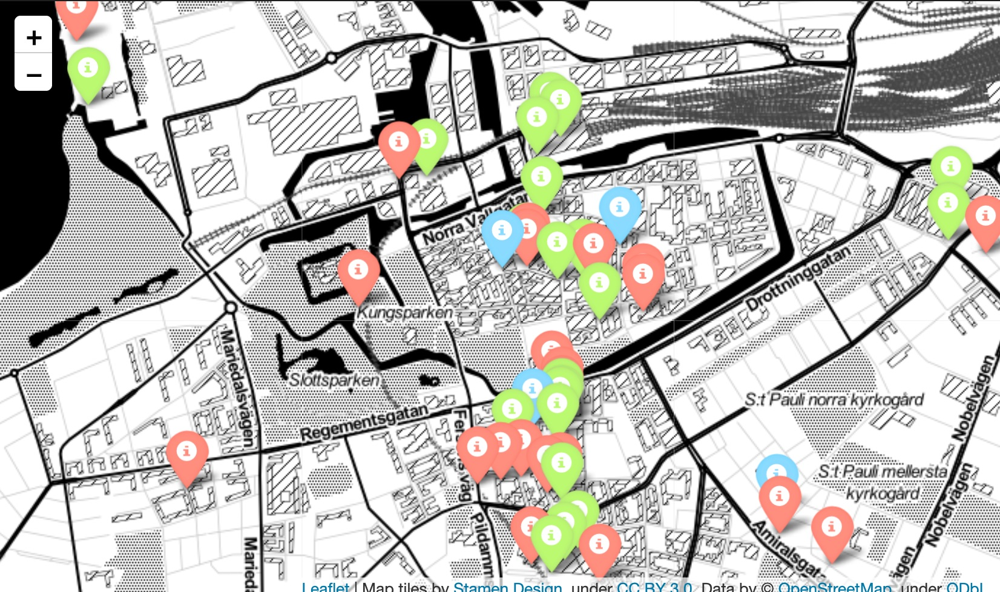

#### Oslo
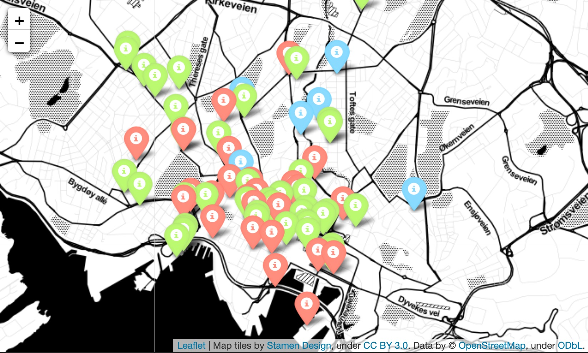

#### Copenhagen
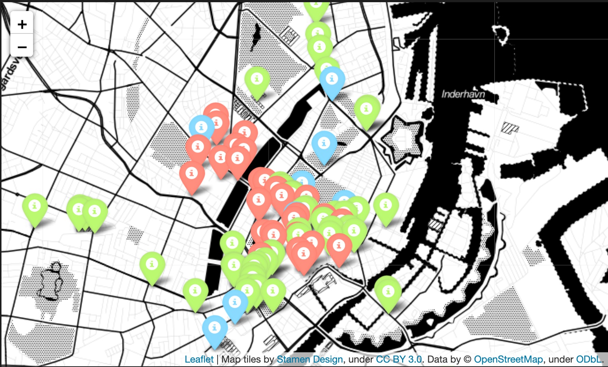

We can see how the chains cafes seems to organize in clusters whereas the specialty cafes position in general outside the more dense areas.

### 3.2. Analyzing the data with K-Means
We can start by using K-Means to identify the clusters. Because K-Means produce clusters of fairly even size we can see what are the differences in the composition of each cluster. 
* Are all the clusters equally distributed? 
* or are there clusters with bigger percentage of one kind of cafe?

#### 3.2.1. K: Number of clusters
K-Means requirers that we define the number of clusters.

To select the number of cluster we can use two metrics:

* Distortion: within-cluster sum-of-squares. The distances from the cluster-center to its elements.
* Silhouette coefficients: near +1 indicates that the sample is far away from the neighboring clusters. A value of 0 indicates that the sample is on or very close to the decision boundary between two neighboring clusters and negative values indicate that those samples might have been assigned to the wrong cluster. Basically how well separated are the cluster from each other


We want a number of clusters that give us:
* a low distortion, that's to say elements of the cluster are close to each other
* and a big average silhouette, in other words, elements of the border of the cluster are far from the border elements of the neighbor cluster.

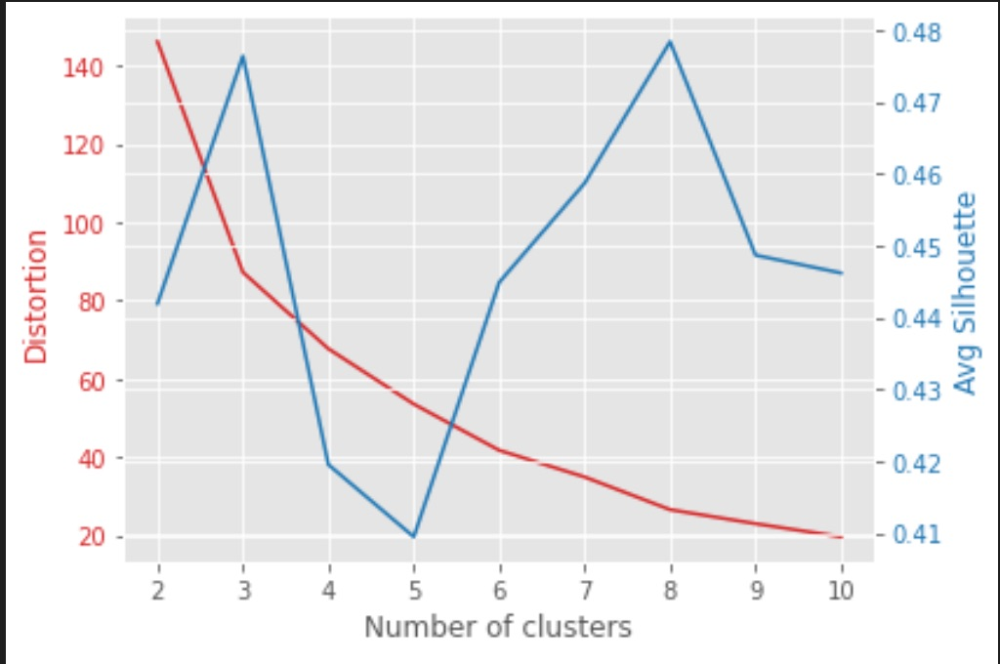

This is the curve of distortion and average silhouette for Stockholm. We can see how with `k=8` we get the best result. 

#### 3.2.2. K-Means clustering
Each city will have a different k number that we will use in the clustering with K-Means. We can visualize this in the map using markers of different colors for each cluster. We can also use the cluster labels to group the data and count the number of each kind of cafe per cluster.

Here we can see how the cafes are clustered in Stockholm and the proportion of each cafe per cluster.

| 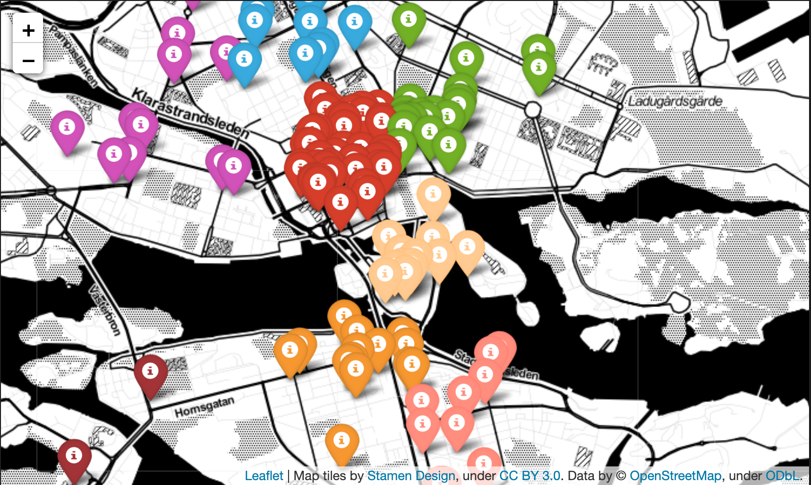      |  |
| -----------------------------------|-------------------------------------|

### 3.3. Analyzing the data with OPTICS
We can try another clustering algorithm like: OPTICS (Ordering Points To Identify the Clustering Structure) which is closely related to Density-Based Spatial Clustering. This algorithm has this main characteristics:

1. The DBSCAN algorithm views clusters as areas of high density separated by areas of low density.
2. The central component to the DBSCAN is the concept of core samples, which are samples that are in areas of high density.
3. Any sample that is not a core sample, and is at least epsilon in distance from any core sample, is considered an outlier by the algorithm.

This can help us understand how densely packed are the clusters and where specialty cafes position themselves respectively to the areas of high density:
* Are specialty cafes part of the core sample of the any cluster?
* or they locate in the periphery and are considered outliers by the algorithm? 

#### 3.3.1. Scikit OPTICS:
We will be using the OPTICS implementation from Scikit: https://scikit-learn.org/stable/modules/generated/sklearn.cluster.OPTICS.html . This module uses by default an automatic cluster method called "xi" that doesn't require us to define the epsilon parameter of a regular DBSCAN. We will first analyze Stockholm only but in the results section we will combine the result for all the cities to get to a more general conclusion.

#### 3.3.2. Visualizing in the map
The clusters in this algorithm are define by zones of big density of cafes and any cafe that is not close enough to a cluster will be considered an outlier.
In this map, the markers in black represents outliers: cafes that are not part of a cluster.

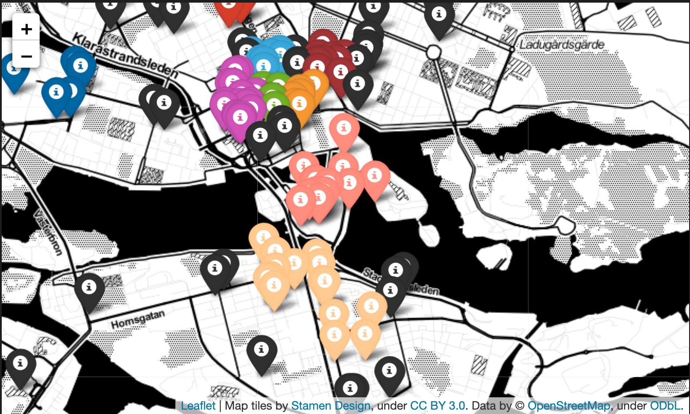

#### 3.3.3. Distribution of coffeehouse 
We can now group the cafes by their kind and check what is the mean distance to the core cafes.

| Cafe   | Distance (m)|
|--------|---------|
|CHAIN	| 322.516466 |
|OTHER	|286.312040|
|SPECIALTY	|416.936417|

The specialty cafes are in average more distant from the core elements: 416m in average. This can indicate that specialty cafes are in the edges or they are outliers of the clusters.

We can see the distance distribution for each kind of cafe in Stockholm.
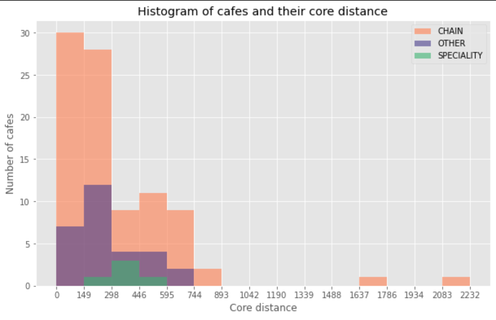

From this histogram we can highlight that:
* chains are present in high densities with most of them between 0 to 150 meters distance. 
* other cafes are more common in ~150 to ~300m distance from each other.
* specialty cafes are present on the edges and when both other and chains has relative low presence.

## 4. Results
Following the methodology presented in previous section we can now apply this to the cities of: Stockholm, Gothenburg, Malmö, Oslo and Copenhagen.

### 4.1 K-Means
In the following table we summarize the process for each city
| Metrics | Results |
|---------|-------- |
|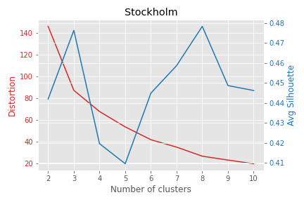 | 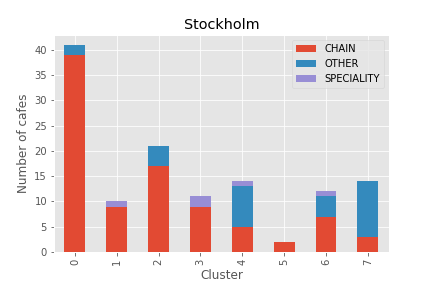 |
|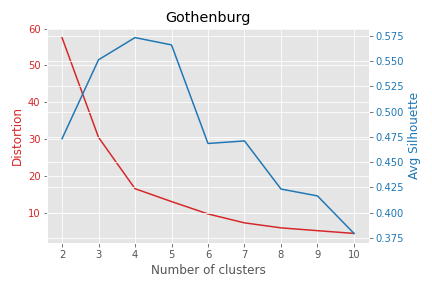 | 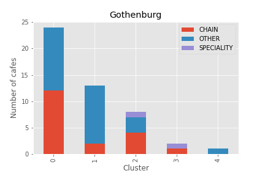 |
| |  |
|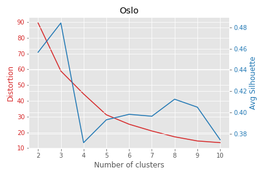 | 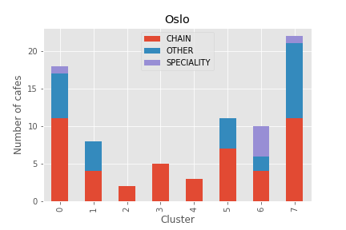 |
|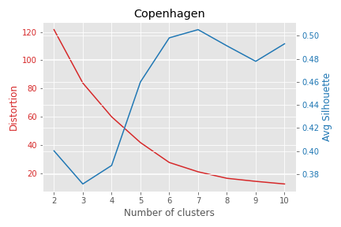 | 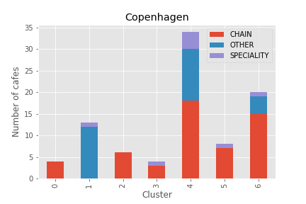 |


### 4.2 OPTICS
#### 4.2.1. Mean distance to core samples
Using the OPTICS clustering we can see the average distance to core samples per coffeehouse kind per city.

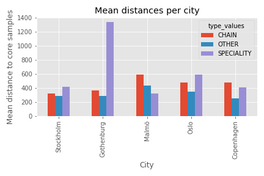

This figure shows how in average specialty cafes are more distant than other kind of cafes, except in the case of Malmö.

#### 4.2.2. Histogram of distance to core samples
If we combine the results of the OPTICS clustering run for each city we can get the following statistics:
|	|CHAIN |	OTHER	|SPECIALITY|
|--|-----|-------|----------|
|count|	235.000000|	134.000000|	25.000000|
|mean|	421.699994|	318.896797|	515.870274|
|std|	444.343202|	229.374135|	405.994959|
|min|	44.467478|	42.600131|	112.631857|
|25%|	155.331694|	172.903517|	255.602859|
|50%|	233.823012|	244.979202|	443.330628|
|75%|	519.591116|	395.650190|	595.208744|
|max|	2363.353668|	1394.030049|	2152.650723|


A histogram of the distance to core elements of all the cafes in the studied cities.

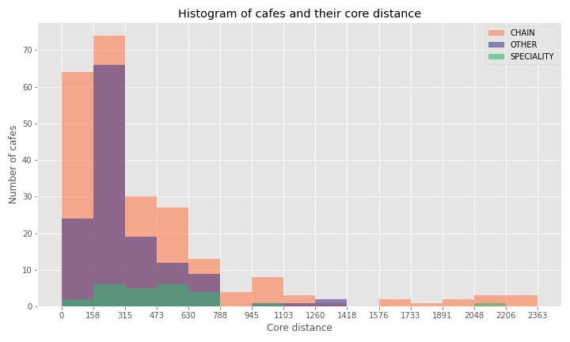

In this figure we can see how this three kinds of cafes have different distributions. In short distances to the core samples there is bigger proportion of coffeehouses chains. Traditional cafes placed themselves mainly 160 to 300 meters from core samples. While the specialty cafes tends to be around 160 to 800 meters from the core samples.

#### 4.2.3. Box and violin plots
This two plots helps us see the differences in distribution of the distance to core samples.

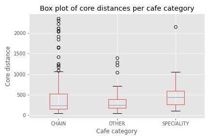

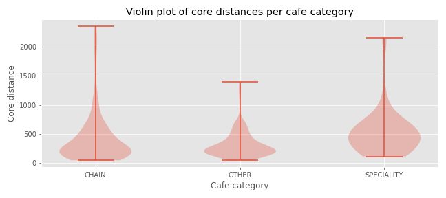

#### 4.2.4 Core vs outliers samples
We can plot the core vs the outliers identified by the OPTICS algorithm and we can see that only the specialty cafes are identified more often as outliers than core samples. 

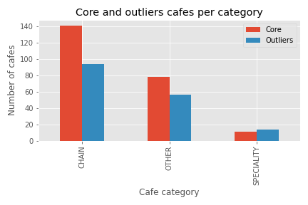

We can see that both traditional cafes and coffeehouses chains have a similar mean but the chains have bigger presence in short distances and a longer tail, spreading to very far distances. Specialty cafes have a higher mean and they distributes more evenly around it.

## Conclusion

Even though all the stores analyzed in this report belong to the same category of coffeehouses we can see a difference among this three categories just by inspecting their geographical location.
I would like to highlight the following points:
 1. Using K-Means we can see that not all the cluster have equals proportions of each kind of coffeehouse. In fact most of the clusters have a dominant kind kind of cafe. 
 2. Coffeehouses chains tends to create dense clusters. This kind of cafe can be very close one to another. Especially around areas like train stations or cities main avenues. 
 3. Traditional cafes locates for the most part between 160 and 315 meters from other cafes. This makes them part of the cafes cluster for the most part
 4. Specialty cafes are in general outliers and they locate outside the cafes clusters.  

A barista friend who has been in the profession for more than 10 years explained me the reason why cafes of the same owner (like chains) will locate close to each other. The rationale is management and shared resources. The manager of cafe can run two places if they are close by and in case of need one cafe can provide with supplies (coffee, cups, filters) to the other. By sharing baristas across the different locations a manager can make sure that the chain has a consistent quality. 

To close this report I would like to highlight:
* The amount of information that is freely available from amazing websites like European Coffee Trip.
* Even with an small piece of data like the geographical location and the store name we can infer very interesting results.
* Having access to someone with knowledge on the field can help us understand the causes of the results, confirming and/or questioning them.
